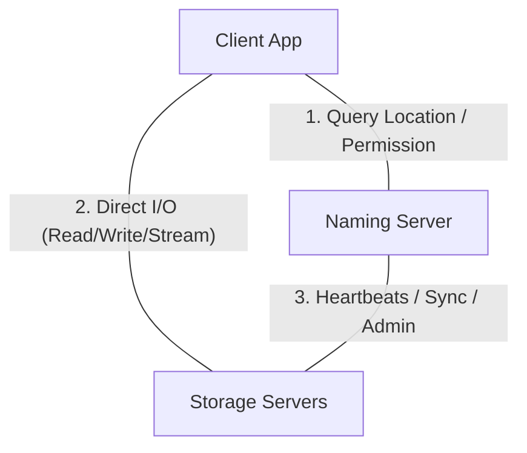

# Distributed Document System

A secure, high-performance, and fault-tolerant distributed document management system built in C. The project implements concurrent sentence-level collaborative editing, naming server directories, heartbeats, backup replication, tags/checkpoints, and remote code execution.

---

## System Architecture

The project consists of three main components communicating via a custom TCP protocol over sockets:



### 1. Client (`client_app`)
- Provides an interactive command-line interface (CLI) for users to register and run operations.
- Communicates first with the Naming Server to query file presence, check permissions, or perform admin operations.
- Contacts the target Storage Server directly for high-performance reading, writing, and streaming of file contents.

### 2. Naming Server (`name_server`)
- Acts as the central directory registry maintaining mapping between filenames, primary storage server sockets, backup sockets, and user permissions.
- Employs a fast **djb2 hash map** (with separate chaining) and an **LRU Cache** (capacity: 5) to achieve $O(1)$ file lookup times.
- Actively polls connected Storage Servers using periodic asynchronous heartbeats. Detects failures and triggers automatic backup failover within 3 failed heartbeats.
- Manages access control lists and request approval queues.

### 3. Storage Server (`storage_server`)
- Physically stores documents and metadata on disk (under `./ss_storage` or custom directory).
- Implements **sentence-level locking** to support collaborative edits. Documents are held in memory as linked lists of sentences (which consist of word nodes).
- Handles write updates and commits edits atomically. Rebuilds and adjusts sentence segments when punctuation marks (delimiters) are inserted.
- Provides support for checkpoint tags, revert commands, local folder organization, and replication mirroring.

---

## Core Features

- **Sentence-Level Collaborative Editing**: Multiple clients can edit different sentences of the same document simultaneously. Write conflicts only occur if clients attempt to modify the *same* sentence index.
- **Atomic Commits**: Edit sessions queue operations by word index and virtual count. When a client issues `ETIRW` (commit), the updates are merged, verified, written to disk, and backup replicas are updated.
- **Failover & Fault Tolerance**: If a storage server goes offline, client requests are redirected to a backup server. Recovering storage servers automatically sync their missing contents back from active backups.
- **Access Control List (ACL)**: File owners can grant permissions (`READ`/`WRITE`) or revoke access. Non-owners can request access, which owners approve or deny via a pending request queue.
- **Folder Navigation**: Create folders, move files, and view contents recursively.
- **Checkpoints**: Snapshot file contents under tags, list tags, and revert to any saved checkpoint with an automatic undo backup.
- **Remote execution**: Run files containing shell scripts remotely on the Storage Server and stream console outputs line-by-line.

---

## Directory of Interactive Commands

When running the client, the following shell commands are supported:

| Command | Usage / Description | Example |
|---|---|---|
| `CREATE` | `CREATE <filename>`<br>Creates a new empty file. | `CREATE doc.txt` |
| `READ` | `READ <filename>`<br>Directly reads and prints file content. | `READ doc.txt` |
| `WRITE` | `WRITE <filename> <sentence_index>`<br>Starts an interactive edit session for a specific sentence. | `WRITE doc.txt 0` |
| `ETIRW` | `ETIRW`<br>Inside a write session, commits edits and releases the sentence lock. | `ETIRW` |
| `DELETE` | `DELETE <filename>`<br>Deletes a file and its backups. | `DELETE doc.txt` |
| `STREAM` | `STREAM <filename>`<br>Streams file word-by-word with artificial delays. | `STREAM doc.txt` |
| `VIEW` | `VIEW [-a] [-l]`<br>Lists files. `-a` shows all files; `-l` shows detailed stats. | `VIEW -l` |
| `INFO` | `INFO <filename>`<br>Shows file owner, size, word/char counts, modification times, and access list. | `INFO doc.txt` |
| `ADDACCESS` | `ADDACCESS -R\|-W <filename> <username>`<br>Grants Read (`-R`) or Write (`-W`) access. | `ADDACCESS -W doc.txt bob` |
| `REMACCESS` | `REMACCESS <filename> <username>`<br>Removes a user's permissions. | `REMACCESS doc.txt bob` |
| `REQACCESS` | `REQACCESS -R\|-W <filename>`<br>Sends a pending access request to the file's owner. | `REQACCESS -W doc.txt` |
| `CHECKREQUESTS` | `CHECKREQUESTS`<br>Interactive prompt for owners to approve/deny pending access requests. | `CHECKREQUESTS` |
| `CREATEFOLDER` | `CREATEFOLDER <foldername>`<br>Creates a folder directory on the storage server. | `CREATEFOLDER notes` |
| `MOVE` | `MOVE <filename> <foldername>`<br>Moves a file into a folder. | `MOVE doc.txt notes` |
| `VIEWFOLDER` | `VIEWFOLDER <foldername>`<br>Lists files residing inside a folder. | `VIEWFOLDER notes` |
| `CHECKPOINT` | `CHECKPOINT <filename> <checkpoint_tag>`<br>Snapshots the file content under a custom tag. | `CHECKPOINT doc.txt tag1` |
| `VIEWCHECKPOINT` | `VIEWCHECKPOINT <filename> <checkpoint_tag>`<br>Views content of a specific checkpoint. | `VIEWCHECKPOINT doc.txt tag1` |
| `REVERT` | `REVERT <filename> <checkpoint_tag>`<br>Reverts the file's current state to a checkpoint. | `REVERT doc.txt tag1` |
| `LISTCHECKPOINTS` | `LISTCHECKPOINTS <filename>`<br>Lists all checkpoints created for a file. | `LISTCHECKPOINTS doc.txt` |
| `UNDO` | `UNDO <filename>`<br>Reverts a file swap or reverts the last checkpoint revert. | `UNDO doc.txt` |
| `LIST` | `LIST`<br>Lists registered users. | `LIST` |
| `QUIT` / `EXIT` | Disconnects and exits. | `QUIT` |

---

## Compilation & Run Instructions

### 1. Compile the Project
Build all three executables (`name_server`, `storage_server`, `client_app`):
```bash
make
```

### 2. Start the Naming Server
```bash
./name_server
```

### 3. Start a Storage Server
```bash
./storage_server [port] [storage_path] [ss_ip] [nm_ip]
```
*Example:*
```bash
./storage_server 8082 ./ss_storage 127.0.0.1 127.0.0.1
```

### 4. Start the Client Application
```bash
./client_app [nm_ip]
```
*Example:*
```bash
./client_app 127.0.0.1
```

### 5. Run Automated Tests
```bash
bash test_all.sh
```

---

## System Assumptions

1. **Information Commands**: The `INFO` command does not require access permissions to inspect file metadata details.
2. **Directory Access**: Users can traverse and access folders created by other users.
3. **Undo Checkpoints**: If a file moves from State A to State B, an `UNDO` from B restores State A. A subsequent `UNDO` toggles back to State B (restores the last state before the undo).
4. **Delimiters**: Writing a word ending with a punctuation mark (e.g. `.`, `!`, `?`, `\n`) automatically registers as a sentence boundary.